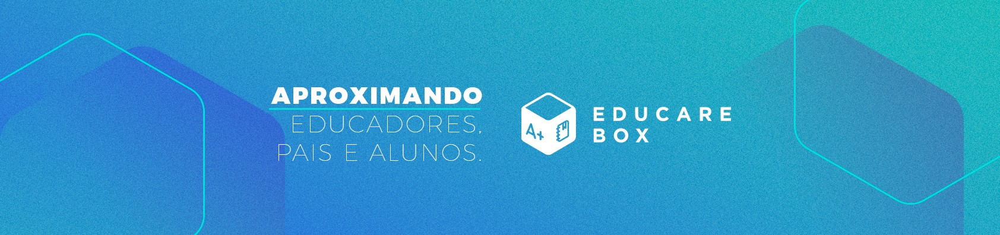

# Hi there, I'm Filipe Mendes Arruda 👋

<p align="center">
  
</p>

<h3 align="center">
  🚀 Founder & CTO at <a href="https://www.agendadigitaleducarebox.com/">EducareBox</a> | Software Architect | Engineering Leader
</h3>

<p align="center">
  <em>Transforming ideas into scalable digital solutions through innovative technology and strategic leadership</em>
</p>

---

## 🎯 About Me

I'm a seasoned **Software Developer**, **Engineering Leader**, and **System Designer** with extensive experience in building and scaling technology organizations. As the Founder and CTO of EducareBox, I lead technical strategy and innovation while fostering high-performing engineering teams.

**What drives me:**
- 🔧 **System Architecture**: Designing resilient, scalable systems that power business growth
- 👥 **Technical Leadership**: Mentoring developers and building world-class engineering cultures  
- 🌟 **Innovation**: Turning complex challenges into elegant, maintainable solutions
- 📚 **Continuous Learning**: Staying at the forefront of emerging technologies and best practices

## 💼 Professional Focus

```
🏗️  System Design & Architecture    🎯  Technical Strategy & Vision
👨‍💼  Engineering Leadership          🚀  Product Development & Innovation  
⚡  Performance Optimization        🔄  DevOps & Cloud Infrastructure
🤝  Cross-functional Collaboration  📊  Data-Driven Decision Making
```

## 🛠️ Technical Expertise

**Languages & Frameworks:**


**Infrastructure & Tools:**


## 🏢 Leadership Philosophy

> *"Great software is built by great teams. My role is to create environments where exceptional engineers can do their best work while delivering solutions that make a real impact."*

**Core Leadership Principles:**
- **Empowerment**: Trust teams with ownership and autonomy
- **Growth Mindset**: Foster continuous learning and professional development
- **Technical Excellence**: Champion best practices and code quality
- **Strategic Thinking**: Align technical decisions with business objectives

## 📈 GitHub Analytics

<div align="center">
  
[](https://github.com/filipemarruda)

[](https://github.com/filipemarruda)

</div>

## ⚡ Development Activity

<div align="center">
  
[](https://wakatime.com/@9c824246-473b-4a43-910b-9f25f2afe8a2)

[](https://wakatime.com/@9c824246-473b-4a43-910b-9f25f2afe8a2)

</div>

## 🤝 Let's Connect

I'm always open to discussing technology, leadership, system design, or potential collaborations.

<p align="center">
  <a href="https://www.linkedin.com/in/filipemarruda/">
    
  </a>
  <a href="mailto:filipemarruda@gmail.com">
    
  </a>
  <a href="https://stackoverflow.com/users/6332574/filipe-mendes">
    
  </a>
  <a href="https://github.com/filipemarruda">
    
  </a>
</p>

---

<div align="center">
  


**"Building the future, one commit at a time"** 🚀

</div>
